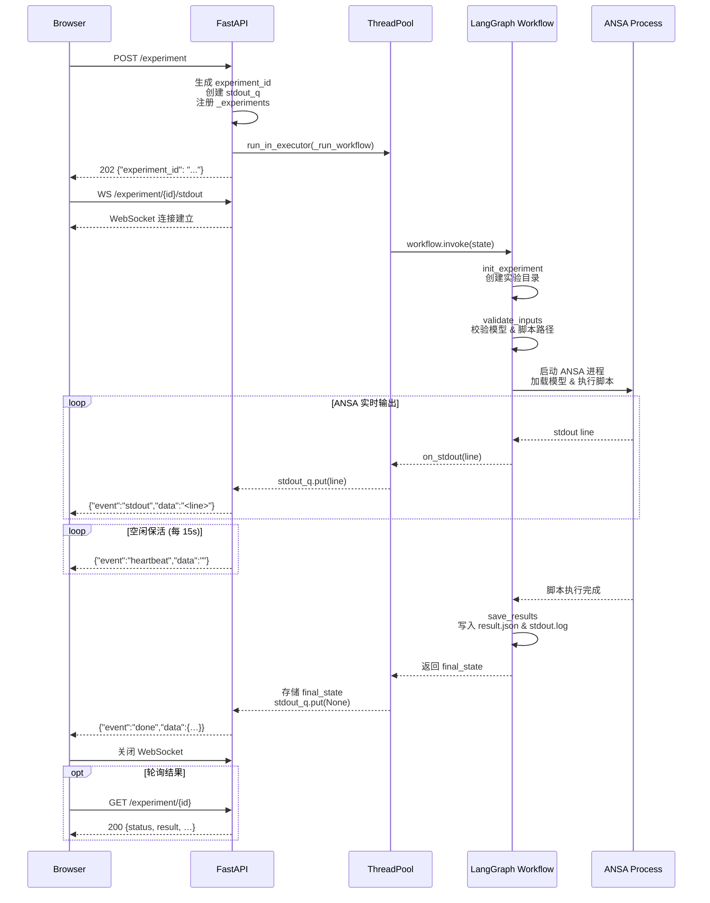

# MCWF PoC — Backend

MCWF（MetaCreate Workflow）概念验证后端，将 **ANSA**（FEA 前处理工具）与基于 **LangGraph** 的智能体工作流系统集成。通过 IAP（Inter-ANSA Protocol）协议与 ANSA 进程通信，并以 **FastAPI REST + WebSocket** 接口实时推送工作流执行状态。

## 目录

- [项目结构](#项目结构)
- [技术栈](#技术栈)
- [快速开始](#快速开始)
- [环境变量](#环境变量)
- [Agent 配置（graph.json）](#agent-配置graphjson)
- [API 接口](#api-接口)
- [架构概览](#架构概览)
- [核心模块](#核心模块)
- [测试](#测试)

## 项目结构

```
backend/
├── app/
│   ├── api/            # FastAPI 路由（REST + WebSocket 端点）
│   ├── agents/         # LangGraph 智能体节点（ANSA 操作）
│   ├── core/           # ANSA 后端核心 & 项目管理
│   ├── graph/          # LangGraph 工作流定义
│   └── config.py       # 集中配置（Pydantic Settings，从 .env 读取）
├── scripts/            # ANSA Python 脚本（零件分类等）
├── tests/              # 单元测试
├── data/
│   └── shared/         # 共享模型文件（demo.ansa）
├── experiments/        # 运行时实验输出
├── graph.json          # Agent 配置（名称、脚本、参数）
├── .env.example        # 环境变量模板
└── pyproject.toml      # 项目依赖 & 元数据
```

## 技术栈

| 组件 | 版本要求 |
|------|---------|
| Python | ≥ 3.12, < 4.0 |
| FastAPI | ≥ 0.115.0 |
| Uvicorn | ≥ 0.34.0 |
| LangChain | ≥ 1.2.13 |
| LangGraph | ≥ 1.1.3 |
| LangChain-OpenAI | ≥ 1.1.11 |
| Pydantic Settings | ≥ 2.0.0 |

构建工具：**Poetry**（poetry-core ≥ 2.0.0）

## 快速开始

### 前置条件

- Python 3.12+
- [Poetry](https://python-poetry.org/) 包管理器
- ANSA 已安装并设置 `ANSA_HOME` 环境变量

### 安装依赖

```bash
cd backend
poetry install
```

### 配置

复制 `.env.example` 为 `.env` 并根据实际环境修改路径：

```bash
cp .env.example .env
```

`.env` 文件示例：

```ini
# LangSmith
LANGCHAIN_TRACING_V2=true
LANGCHAIN_API_KEY=your_langsmith_api_key_here
LANGCHAIN_PROJECT=mcwf_poc

# Server
HOST=0.0.0.0
PORT=8000

# Directory Configuration (所有路径配置必须在此指定)
EXPERIMENTS_DIR=experiments
SCRIPTS_DIR=scripts
DATA_SHARED_DIR=data/shared
GRAPH_CONFIG_PATH=graph.json
```

> **注意**：`EXPERIMENTS_DIR`、`SCRIPTS_DIR`、`DATA_SHARED_DIR`、`GRAPH_CONFIG_PATH` 均为必填项，没有硬编码的默认值。

### 启动服务

```bash
poetry run uvicorn app.api:app --host 0.0.0.0 --port 8000 --reload
```

服务启动后：

- Swagger UI：`http://localhost:8000/docs`
- REST 端点：`GET /workflow`、`POST /experiment`、`GET /experiment/{id}`
- WebSocket 端点：`ws://localhost:8000/experiment/{id}/stdout`

### 独立运行工作流

```bash
poetry run python -m app.graph.workflow
```

## 环境变量

所有目录配置通过 `.env` 文件提供，无硬编码默认值。

| 变量 | 必填 | 说明 |
|------|------|------|
| `EXPERIMENTS_DIR` | ✅ | 实验输出目录 |
| `SCRIPTS_DIR` | ✅ | ANSA 脚本目录 |
| `DATA_SHARED_DIR` | ✅ | 共享模型数据目录 |
| `GRAPH_CONFIG_PATH` | ✅ | Agent 配置文件路径（`graph.json`） |
| `HOST` | — | 服务监听地址（默认 `0.0.0.0`） |
| `PORT` | — | 服务监听端口（默认 `8000`） |
| `LANGCHAIN_TRACING_V2` | — | 启用 LangSmith 追踪 |
| `LANGCHAIN_API_KEY` | — | LangSmith API 密钥 |
| `LANGCHAIN_PROJECT` | — | LangSmith 项目名称 |
| `ANSA_HOME` | — | ANSA 安装路径 |

## Agent 配置（graph.json）

Agent 的运行时配置存放在 `graph.json` 中，工作流启动时按 `name` 查找对应 Agent 条目。

```json
{
  "agents": [
    {
      "name": "classifier",
      "type": "AnsaAgent",
      "model_path": "demo.ansa",
      "script_path": "part_classifier.py",
      "script_kwargs": {}
    }
  ]
}
```

| 字段 | 说明 |
|------|------|
| `name` | Agent 逻辑名称，决定工作流中的节点命名（例如 `validate_classifier_inputs`、`run_classifier`） |
| `type` | Agent 类型（当前仅支持 `AnsaAgent`） |
| `model_path` | 模型文件名，运行时与 `DATA_SHARED_DIR` 拼接为完整路径 |
| `script_path` | 脚本文件名，运行时与 `SCRIPTS_DIR` 拼接为完整路径 |
| `script_kwargs` | 传递给脚本执行的额外关键字参数（JSON 对象） |

### 节点命名规则

Agent 的 `name` 决定其在 LangGraph 工作流中的节点名称：

- **验证节点**：`validate_{name}_inputs` — 例如 `validate_classifier_inputs`
- **执行节点**：`run_{name}` — 例如 `run_classifier`

## API 接口

采用 REST + WebSocket 两阶段架构：先通过 HTTP 启动工作流，再通过 WebSocket 实时接收输出。

### `GET /workflow`

获取编译后的 ANSA 工作流图的 JSON 表示（节点、边及其关系）。

- **响应 200**：工作流图 JSON（包含 `nodes`、`edges` 等结构信息）

### `POST /experiment`

启动 ANSA 工作流（后台异步执行），立即返回 `experiment_id`。

- **响应 202**：`{"experiment_id": "<uuid>"}`

### `GET /experiment/{experiment_id}`

轮询工作流最终结果。

- **响应 200**：工作流完成，返回最终状态 JSON
- **响应 202**：工作流仍在运行，`{"status": "running"}`
- **响应 404**：未知的 `experiment_id`

### `WS /experiment/{experiment_id}/stdout`

实时流式推送 ANSA 标准输出（含 15 秒心跳保活）。

**服务端 → 客户端消息**（JSON 格式 `{"event": ..., "data": ...}`）：

| 事件 | 说明 |
|------|------|
| `stdout` | ANSA 实时输出行 |
| `heartbeat` | 心跳保活 |
| `done` | 工作流完成，返回最终状态 |
| `error` | 不可恢复的错误信息 |

**客户端 → 服务端消息**（预留，暂未实现）：

| 动作 | 说明 |
|------|------|
| `cancel` | 请求优雅取消 |
| `input` | Human-in-the-loop 回复 |

**客户端示例（JavaScript）：**

```javascript
// 1. 启动工作流
const resp = await fetch("/experiment", { method: "POST" });
const { experiment_id } = await resp.json();

// 2. 连接 stdout 流
const ws = new WebSocket(`ws://host/experiment/${experiment_id}/stdout`);
ws.onmessage = (ev) => {
    const msg = JSON.parse(ev.data);
    if (msg.event === "stdout") console.log(msg.data);
    if (msg.event === "done")  { console.log(msg.data); ws.close(); }
};
```

## 架构概览

```
┌──────────────────────────────────────────────┐
│           FastAPI Server (:8000)              │
│  POST /experiment          → 启动工作流       │
│  GET  /workflow            → 获取工作流图 JSON  │
│  GET  /experiment/{id}     → 轮询结果         │
│  WS   /experiment/{id}/stdout → 实时输出流    │
└──────────────────┬───────────────────────────┘
                   ↓
┌──────────────────────────────────────────────┐
│       LangGraph Workflow (graph/)            │
│  graph.json → Agent 配置（name, paths, kwargs）│
│  .env       → 目录配置（data, scripts, ...）  │
│                                              │
│  START → init_experiment                     │
│       → validate_{name}_inputs               │
│       → run_{name} (retry×3)                 │
│       → save_results → END                   │
└──────────────────┬───────────────────────────┘
                   ↓
┌──────────────────────────────────────────────┐
│       ANSA Backend (core/ansa_backend.py)    │
│  AnsaProcess                                 │
│  ├─ IAP Connection (TCP Socket)              │
│  ├─ Stdout Reader (异步线程)                  │
│  └─ Script Execution (参数注入)               │
└──────────────────┬───────────────────────────┘
                   ↓
┌──────────────────────────────────────────────┐
│          ANSA (FEA Pre-processor)            │
│  模型加载 · 脚本执行 · 网格操作 · 导出         │
└──────────────────────────────────────────────┘

输出: experiments/{experiment_id}/
  ├─ result.json    # 工作流状态 & 脚本结果
  └─ stdout.log     # ANSA 标准输出日志
```

## 核心模块

| 模块 | 路径 | 说明 |
|------|------|------|
| **AnsaAgent** | `app/agents/ansa_agent.py` | Agent 节点实现，通过 `name` 生成动态节点名称（`validate_{name}_inputs`、`run_{name}`），封装输入验证、ANSA 执行与路由逻辑 |
| **Workflow** | `app/graph/workflow.py` | LangGraph 工作流构建，从 `graph.json` 按名称加载 Agent 配置，目录路径从 `.env` 获取 |
| **State** | `app/graph/state.py` | `AnsaAgentState` TypedDict，工作流状态定义 |
| **Config** | `app/config.py` | Pydantic Settings，所有路径配置从 `.env` 读取（无硬编码默认值） |
| **AnsaProcess** | `app/core/ansa_backend.py` | ANSA 进程管理 & IAP 协议通信 |
| **Project** | `app/core/project.py` | 项目管理、模型操作、脚本执行 |
| **API** | `app/api/routes.py` | REST + WebSocket 路由 |

## 测试

```bash
cd backend
poetry run pytest tests/ -v
```

测试覆盖 `app/core/` 下的 ANSA 后端通信和项目管理模块。
```

### 请求时序图

下图展示了一次完整的实验请求流程——从浏览器发起 `POST /experiment` 到通过 WebSocket 实时接收 ANSA 输出并获取最终结果：



## 核心模块

### `app/api/` — API 层

FastAPI 应用初始化，提供 REST 端点（启动/轮询工作流）和 WebSocket 端点（实时 stdout 流推送）。

### `app/agents/` — 智能体节点

`AnsaAgent` 封装了工作流中的 ANSA 操作节点：

- **`validate_inputs`** — 验证模型文件和脚本路径
- **`run_ansa`** — 打开模型并执行脚本（配置 `RetryPolicy`，最多重试 3 次）
- **`should_run`** — 条件路由（验证通过则执行，否则跳至保存结果）

### `app/graph/` — 工作流

- **`state.py`** — 定义工作流状态（`AnsaAgentState`）：实验 ID、模型路径、脚本路径、执行状态、结果等
- **`workflow.py`** — 构建 LangGraph 工作流图，`run_ansa` 节点配备重试策略，提供同步/异步执行入口及 JSON 图导出

### `app/core/` — 核心功能

| 模块 | 说明 |
|------|------|
| `ansa_backend.py` | ANSA 进程管理 & IAP 协议通信 |
| `project.py` | 项目 CRUD、模型加载/保存、脚本执行 |
| `checks.py` | 质量检查（网格、几何、穿透、通用） |
| `connections.py` | 连接定义读取与实现 |
| `export.py` | 求解器格式 & 几何格式导出 |
| `mesh.py` | 批量网格划分 |
| `session.py` | 会话状态管理（含撤销/重做） |

### `scripts/` — ANSA 脚本

- **`part_classifier.py`** — 零件分类器：按命名规则识别零件、焊点、螺栓、螺母、垫片等类别，并生成分类 PNG 快照

## 测试

```bash
# 运行全部测试
poetry run pytest

# 运行指定测试文件
poetry run pytest tests/core/test_ansa_backend.py -v
poetry run pytest tests/core/test_project.py -v
```

测试覆盖：

- **`test_ansa_backend.py`** — IAP 协议连接、握手、脚本执行、进程生命周期、参数注入
- **`test_project.py`** — 项目创建/加载/保存、模型打开、结果状态校验、脚本解析

## License

见项目根目录 [LICENSE](../LICENSE) 文件。
